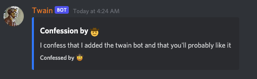

# Twain Bot
> Twain is an advanced anonymous confessions Discord bot

## Add the bot to your server

[Click here](https://discord.com/api/oauth2/authorize?client_id=926070077361631272&permissions=171866064960&scope=bot%20applications.commands) to add the bot to your server.

## Report issues

Report bot issues (including feature requests) using the [issues](https://github.com/ethanent/twain-bot-issues/issues) tab in this repository.

By creating issues you agree that they may be used to improve the bot, without compensation to you.

## Moderation

Server admins can manage bans on anonymous confessions through multiple means, but they are not permitted to see who made a confession.

To ban an anonymous poster, admins provide the bot with the message link to the anonymous message.
